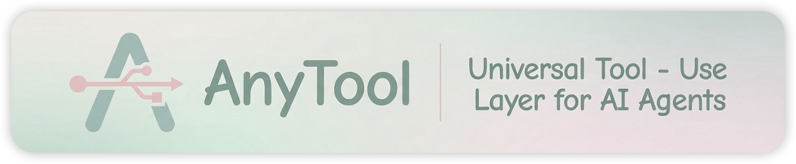

<div align="center">

<picture>
    
</picture>

## AnyTool: Universal Tool-Use Layer for AI Agents

### ✨ **One Line of Code to Supercharge any Agent with <br>Fast, Scalable and Powerful Tool Use** ✨

[](https://github.com/HKUDS/AnyTool/)
[](https://www.python.org/)
[](https://opensource.org/licenses/MIT/)
[](./COMMUNICATION.md) 
[](./COMMUNICATION.md)

| ⚡ **Fast - Lightning Tool Retrieval** &nbsp;|&nbsp; 📈 **Self-Evolving Tool Orchestration** &nbsp;|&nbsp; ⚡ **Universal Tool Automation** |

</div>

## 🎯 What is AnyTool?

AnyTool is a **Universal Tool-Use Layer** that transforms how AI agents interact with tools. It solves three fundamental challenges that prevent reliable agent automation: **overwhelming tool contexts**, **unreliable community tools**, and **limited capability coverage** -- delivering the first truly intelligent tool orchestration system for production AI agents.

## 💡 Research Highlights

⚡ **Fast - Lightning Tool Retrieval**
- **Smart Context Management**: Progressive tool filtering delivers exact tools in milliseconds through multi-stage pipeline, eliminating context pollution while maintaining speed.

- **Zero-Waste Processing**: Pre-computed embeddings and lazy initialization eliminate redundant processing - tools are instantly ready across all executions.

📈 **Scalable - Self-Evolving Tool Orchestration**
- **Adaptive MCP Tool Selection**: Smart caching and selective re-indexing maintain constant performance from 10 to 10,000 tools with optimal resource usage.
  
- **Self-Evolving Tool Optimization**: System continuously improves through persistent memory, becoming more efficient as your tool ecosystem expands.

🌍 **Powerful - Universal Tool Automation**
- **Quality-Aware Selection**: Built-in reliability tracking and safety controls deliver production-ready automation through persistent learning and execution safeguards.

- **Universal Tool-Use Capability**: Multi-backend architecture seamlessly extends beyond web APIs to system operations, GUI automation, and deep research through unified interface.

## ⚡ Easy-to-Use and Effortless Integration

One line to get intelligent tool orchestration. Zero-config setup transforms complex multi-tool workflows into a single API call.

```python
from anytool import AnyTool

# One line to get intelligent tool orchestration
async with AnyTool() as tool_layer:
    result = await tool_layer.execute(
        "Research trending AI coding tools from GitHub and tech news, "
        "collect their features and user feedback, analyze adoption patterns, "
        "then create a comparison report with insights"
    )
```

---

## 📋 Table of Contents

- [🎯 Quick Start](#-quick-start)
- [🚀 Technical Innovation & Implementation](#-technical-implementation)
- [🔧 Configuration Guide](#-configuration-guide)
- [📖 Code Structure](#-code-structure)
- [🔗 Related Projects](#-related-projects)

---

## 🎯 Quick Start

### 1. Environment Setup

```bash
# Clone repository
git clone https://github.com/HKUDS/AnyTool.git
cd AnyTool

# Create and activate conda environment (includes ffmpeg for video recording)
conda create -n anytool python=3.12 ffmpeg -c conda-forge -y
conda activate anytool

# Install dependencies
pip install -r requirements.txt
```

> [!NOTE]
> Create a `.env` file and add your API keys (refer to `anytool/.env.example`).

### 2. Execution Mode: Local vs Server

AnyTool's Shell and GUI backends support two execution modes. You can configure the mode in `anytool/config/config_grounding.json`:

```jsonc
{
  "shell": { "mode": "local", ... },  // or "server"
  "gui":   { "mode": "local", ... }   // or "server"
}
```

#### Local Mode (Default — no server needed)

In **local mode**, Shell and GUI operations are executed directly in-process via `subprocess` / `asyncio`. This is the simplest setup — **no local server required**.

```bash
# Just run your agent — no extra steps!
python your_agent.py
```

> [!TIP]
> **Use local mode when** you are running AnyTool on the same machine you want to control (your own laptop / desktop). This is the recommended mode for most users.

#### Server Mode (for remote VMs / isolation)

In **server mode**, Shell and GUI operations are sent over HTTP to a running `local_server` Flask service. This is required when:

- **Controlling a remote VM** (e.g., OSWorld benchmark environments) — the agent runs on your host, while the server runs inside the VM.
- **Process isolation / sandboxing** — you want script execution in a separate process for security or stability.
- **Multi-machine deployments** — the agent and the execution environment are on different machines.

To use server mode, set `"mode": "server"` in `config_grounding.json`, then install platform-specific dependencies and start the server:

> [!IMPORTANT]
> **Platform-specific setup required**: Different operating systems need different dependencies for desktop control. Please install the required dependencies for your OS before starting the local server:

<details>
<summary><b>macOS Setup</b></summary>

```bash
# Install macOS-specific dependencies
pip install pyobjc-core pyobjc-framework-cocoa pyobjc-framework-quartz atomacos
```

**Permissions Required**: macOS will automatically prompt for permissions when you first run the local server. Grant the following:
- **Accessibility** (for GUI control)
- **Screen Recording** (for screenshots and video capture)

> If prompts don't appear, manually grant permissions in System Settings → Privacy & Security.
</details>

<details>
<summary><b>Linux Setup</b></summary>

```bash
# Install Linux-specific dependencies
pip install python-xlib pyatspi numpy

# Install system packages
sudo apt install at-spi2-core python3-tk scrot
```

> [!NOTE]
> **Optional dependencies:**
> - Accessibility: `pyatspi` + `at-spi2-core`
> - Window management: `wmctrl`
> - Cursor in screenshots: `libx11-dev` + `libxfixes-dev`

</details>

<details>
<summary><b>Windows Setup</b></summary>

```bash
# Install Windows-specific dependencies
pip install pywinauto pywin32 PyGetWindow
```
</details>

After installing the platform-specific dependencies, start the local server:

```bash
python -m anytool.local_server.main
```

> [!NOTE]
> See [`anytool/local_server/README.md`](anytool/local_server/README.md) for complete API documentation and advanced configuration.

#### Mode Comparison

| | Local Mode (`"local"`) | Server Mode (`"server"`) |
|---|---|---|
| **Setup** | Zero — just run your agent | Start `local_server` first |
| **Use case** | Same-machine development | Remote VMs, sandboxing, multi-machine |
| **Shell execution** | `asyncio.subprocess` in-process | HTTP → Flask → `subprocess` |
| **GUI execution** | Direct pyautogui / ScreenshotHelper | HTTP → Flask → pyautogui |
| **Dependencies** | Only core AnyTool | Core + Flask + platform deps |
| **Network** | None required | HTTP between agent ↔ server |

### 3. Quick Integration

AnyTool is a **plug-and-play Universal Tool-Use Layer** for any AI agent. The task passed to `execute()` can come from your agent's planning module, user input, or any workflow system.

```python
import asyncio
from anytool import AnyTool
from anytool.tool_layer import AnyToolConfig

async def main():
    config = AnyToolConfig(
        enable_recording=True,
        recording_backends=["gui", "shell", "mcp", "web"],
        enable_screenshot=True,
        enable_video=True,
    )
    
    async with AnyTool(config=config) as tool_layer:
        result = await tool_layer.execute(
            "Research trending AI coding tools from GitHub and tech news, "
            "collect their features and user feedback, analyze adoption patterns, "
            "then create a comparison report with insights"
        )
        print(result["response"])

asyncio.run(main())
```

> [!TIP]
> **MCP Server Configuration**: For tasks requiring specific tools, add relevant MCP servers to `anytool/config/config_mcp.json`. Unsure which servers to add? Simply add all potentially useful ones, AnyTool's Smart Tool RAG will automatically select the appropriate tools for your task. See [MCP Configuration](#mcp-configuration) for details.

---

## Technical Innovation & Implementation

### 🧩 Challenge 1: MCP Tool Context Overload

**The Problem**. Current MCP agents suffer from a fundamental design flaw: they load ALL configured servers and tools at every execution step, creating an overwhelming action space, creates three critical issues:
- ⚡ **Slow Performance with Massive Context Loading**<br>
  Complete tool set from all pre-configured servers loaded simultaneously at every step, degrading execution speed
  
- 🎯 **Poor Accuracy from Blind Tool Setup**<br>
  Users cannot preview tools before connecting, leading to over-setup "just in case" and confusing tool selection
  
- 💸 **Resource Waste with No Memory**<br>
  Same tools reloaded at every execution step with no caching, causing redundant loading

### ✅ AnyTool's Solution: Tool Context Management Framework

**Motivation**: "Load Everything" → "Retrieve What's Needed"<br>
**Improvement**: Faster tool selection, cleaner context, and efficient resource usage through smart retrieval and memory.

#### **Technical Innovation**:<br>
**🎯 Multi-Stage Tool Retrieval Pipeline**
- **Progressive MCP Tool Filtering**: server selection → tool name matching → tool semantic search → LLM ranking
- **Reduces MCP Tool Search Space**: Each stage narrows down candidate tools for optimizing precision and speed

**💾 Long-Term Tool Memory**
- **Save Once, Use Forever**: Pre-compute tool embeddings once and save them to disk for instant reuse
- **Zero Waste Processing**: No more redundant processing - tools are ready to use immediately across all execution steps

**🧠 Adaptive Tool Selection**
- **Adaptive MCP Tool Ranking**: LLM-based tool selection refinement triggered only when MCP tool results are large or ambiguous
- **Tool Selection Efficiency**: Balances MCP tool accuracy with computational efficiency

**🚀 On-Demand Resource Management**
- **Lazy MCP Server Startup**: MCP server initialization triggered only when specific tools are needed
- **Selective Tool Updates**: Incremental re-indexing of only changed MCP tools, not the entire tool set

---

### 🚨 Challenge 2: MCP Tool Quality Issues

**The Problem**. Current MCP servers suffer from community contribution challenges that create three critical issues:
- 🔍 **Poor Tool Descriptions**<br>
  Misleading claims, non-existent advertised tools, and vague capability specifications lead to wrong tool selection.
  
- 📊 **No Reliability Signals**<br>
  Cannot assess MCP tool quality before use, causing blind selection decisions.
  
- ⚠️ **Security and Safety Gaps**<br>
  Unvetted community tools may execute dangerous operations without proper safeguards.

### ✅ **AnyTool Solution: Self-Contained Quality Management**

**Motivation**: "Blind Tool Trust" → "Smart Quality Assessment"<br>
**Improvement**: Reliable tool selection, safe execution, and autonomous recovery through quality tracking and safety controls.

#### **Technical Innovation:**<br>
**🎯 Quality-Aware Tool Selection**
- **Description Quality Check**: LLM-based evaluation of MCP tool description clarity and completeness.
- **Performance-Based Ranking**: Track call/success rates for each MCP tool in persistent memory to prioritize reliable options.

**💾 Learning-Based Tool Memory**
- **Track Tool Performance**: Remember which MCP tools work well and which fail over time.
- **Smart Tool Prioritization**: Automatically rank tools based on past success rates and description quality.

**🛡️ Safety-First Execution**
- **Block Dangerous Operations**: Prevent arbitrary code execution and require user approval for sensitive MCP tool operations.
- **Execution Safeguards**: Built-in safety controls for all MCP tool executions.

**🚀 Self-Healing Tool Management**
- **Autonomous Tool Switching**: Switch failed MCP tools locally without restarting expensive planning loops.
- **Local Failure Recovery**: Automatically switch to alternative MCP tools on failure without escalating to upper-level agents.
  
---

### 🔄 Challenge 3: Limited MCP Capability Scope

**The Problem**. Current MCP ecosystem focuses primarily on Web APIs and online services, creating significant automation gaps that prevent comprehensive task completion:

- **🖥️ Missing System Operations**<br>
  No native support for file manipulation, process management, or command execution on local systems.

- **🖱️ No Desktop Automation**<br>
  Cannot control GUI applications that lack APIs, limiting automation to web-only scenarios.

- **📊 Incomplete Tool Coverage**<br>
  Limited server categories in community and incomplete tool sets within existing servers create workflow bottlenecks.

### ✅ AnyTool Solution: Universal Capability Extension<br>(MCP + System Commands + GUI Control ≈ Universal Task Completion)

**Motivation**: "Web-Only MCP" → "Universal Task Completion"<br>
**Improvement**: Complete automation coverage through multi-backend architecture that seamlessly extends MCP capabilities beyond web APIs.

**🏗️ Multi-Backend Architecture**
- **MCP Backend**: Community servers for Web APIs and online services
- **Shell Backend**: Bash/Python execution for system-level operations and file management
- **GUI Backend**: Pixel-level automation for any visual application without API requirements
- **Web Backend**: Deep web research and data extraction capabilities

**💡 Self-Evolving Capability Discovery**
- **Intelligent Gap Detection**: Planning agent identifies when MCP tools are insufficient for task requirements
- **Automatic Backend Selection**: Shell/GUI backends automatically fill capability gaps without manual intervention
- **Dynamic Capability Expansion**: Previously impossible tasks become achievable through backend combination

**🎭 Unified Tool Orchestration**
- **Uniform Tool Schema**: All backends expose identical interface for seamless agent tool selection
- **Transparent Backend Switching**: Agents select optimal tools across backend types without knowing implementation details
- **Intelligent Tool Routing**: Automatic routing to the most appropriate backend based on task requirements

**🚀 Seamless Integration Layer**
- **Single Tool Interface**: Unified API that abstracts away backend complexity from AI agents.
- **Cross-Backend Coordination**: Enable complex workflows that span multiple backend capabilities.
- **Consistent Safety Controls**: Apply security and safety measures uniformly across all backend types.

---

## 🔧 Configuration Guide

### Configuration Overview

AnyTool uses a layered configuration system:

- **`config_dev.json`** (highest priority): Local development overrides. Overrides all other configurations.
- **`config_agents.json`**: Agent definitions and backend access control
- **`config_mcp.json`**: MCP server registry
- **`config_grounding.json`**: Backend-specific settings and Smart Tool RAG configuration
- **`config_security.json`**: Security policies with runtime user confirmation for sensitive operations

---

### Agent Configuration

**Path**: `anytool/config/config_agents.json`

**Purpose**: Define agent roles, control backend access scope, and set execution limits to prevent infinite loops.

**Example configuration**:

```json
{
  "agents": [
    {
      "name": "GroundingAgent",
      "class_name": "GroundingAgent",
      "backend_scope": ["gui", "shell", "mcp", "system", "web"],
      "max_iterations": 20
    }
  ]
}
```

**Key Fields**:

| Field | Description | Options/Example |
|-------|-------------|-----------------|
| `backend_scope` | Accessible backends | `[]` or any combination of `["gui", "shell", "mcp", "system", "web"]` |
| `max_iterations` | Maximum execution cycles | Any integer (e.g., `15`, `20`, `50`) or `null` (unlimited) |

---

### MCP Configuration

**Path**: `anytool/config/config_mcp.json` (copy from `config_mcp.json.example`)

**Purpose**: Register MCP servers with connection details. AnyTool automatically discovers tools from all registered servers and makes them available through Smart Tool RAG.

**Example configuration**:

```json
{
  "mcpServers": {
    "github": {
      "command": "npx",
      "args": ["-y", "@modelcontextprotocol/server-github"],
      "env": {
        "GITHUB_PERSONAL_ACCESS_TOKEN": "${GITHUB_TOKEN}"
      }
    }
  }
}
```

---

<details>
<summary><b>Runtime Configuration (AnyToolConfig)</b></summary>

### Runtime Configuration (AnyToolConfig)

**Complete example**:

```python
from anytool import AnyTool
from anytool.tool_layer import AnyToolConfig

config = AnyToolConfig(
    # LLM Configuration
    llm_model="anthropic/claude-sonnet-4-5",
    llm_enable_thinking=False,
    llm_timeout=120.0,
    llm_max_retries=3,
    llm_rate_limit_delay=0.0,
    llm_kwargs={},  # Additional LiteLLM parameters
    
    # Separate models for specific tasks (None = use llm_model)
    tool_retrieval_model=None,   # Model for tool retrieval LLM filter
    visual_analysis_model=None,  # Model for visual analysis
    
    # Grounding Configuration
    grounding_config_path=None,  # Path to custom config file
    grounding_max_iterations=20,
    grounding_system_prompt=None,  # Custom system prompt
    
    # Backend Configuration
    backend_scope=["gui", "shell", "mcp", "web", "system"],
    
    # Workspace Configuration
    workspace_dir=None,  # Auto-create temp dir if None
    
    # Recording Configuration
    enable_recording=True,
    recording_backends=["gui", "shell", "mcp"],
    recording_log_dir="./logs/recordings",
    enable_screenshot=True,
    enable_video=True,
    enable_conversation_log=True,  # Save LLM conversations to conversations.jsonl
    
    # Logging Configuration
    log_level="INFO",
    log_to_file=False,
    log_file_path=None,
)

async with AnyTool(config=config) as tool_layer:
    result = await tool_layer.execute("Your task here")
    # Or with external task_id for benchmark integration:
    # result = await tool_layer.execute("Your task", task_id="my-task-001")
```

</details>

---

<details>
<summary><b>Other Configuration Files</b></summary>

### Backend Configuration

**Path**: `anytool/config/config_grounding.json`

**Purpose**: Configure backend-specific behaviors, timeouts, Smart Tool RAG system for efficient tool selection, and Tool Quality Tracking for self-evolving tool intelligence.

**Key Fields**:

| Backend | Field | Description | Options/Default |
|---------|-------|-------------|-----------------|
| **shell** | `timeout` | Command timeout (seconds) | Any integer (default: `60`) |
| | `conda_env` | Auto-activate conda environment | Environment name or `null` (default: `"anytool"`) |
| | `working_dir` | Working directory for command execution | Any valid path (default: current directory) |
| | `default_shell` | Shell to use | `"/bin/bash"`, `"/bin/zsh"`, etc. |
| **gui** | `timeout` | Operation timeout (seconds) | Any integer (default: `90`) |
| | `screenshot_on_error` | Capture screenshot on failure | `true` or `false` (default: `true`) |
| | `driver_type` | GUI automation driver | `"pyautogui"` or other supported drivers |
| **mcp** | `timeout` | Request timeout (seconds) | Any integer (default: `30`) |
| | `sandbox` | Run in E2B sandbox | `true` or `false` (default: `false`) |
| | `eager_sessions` | Pre-connect all servers at startup | `true` or `false` (default: `false`, lazy connection) |
| **tool_search** | `search_mode` | Tool retrieval strategy | `"semantic"`, `"hybrid"` (semantic + LLM filter), or `"llm"` (default: `"hybrid"`) |
| | `max_tools` | Maximum tools to return from search | Any integer (default: `40`) |
| | `enable_llm_filter` | Enable LLM-based tool pre-filtering | `true` or `false` (default: `true`) |
| | `llm_filter_threshold` | Enable LLM filter when tools exceed this count | Any integer (default: `50`) |
| | `enable_cache_persistence` | Persist embedding cache to disk | `true` or `false` (default: `true`) |
| **tool_quality** | `enabled` | Enable tool quality tracking | `true` or `false` (default: `true`) |
| | `enable_persistence` | Persist quality data to disk | `true` or `false` (default: `true`) |
| | `cache_dir` | Directory for quality cache | Path string (default: `.anytool/tool_quality` in project directory) |
| | `auto_evaluate_descriptions` | Automatically evaluate tool descriptions using LLM | `true` or `false` (default: `true`) |
| | `enable_quality_ranking` | Incorporate quality scores in tool ranking | `true` or `false` (default: `true`) |
| | `evolve_interval` | Trigger self-evolution every N tool executions | Any integer 1-100 (default: `5`) |

---

### Security Configuration

**Path**: `anytool/config/config_security.json`

**Purpose**: Define security policies with command filtering and access control.

**Key Fields**:

| Section | Field | Description | Options |
|---------|-------|-------------|---------|
| **global** | `allow_shell_commands` | Enable shell command execution | `true` or `false` (default: `true`) |
| | `allow_network_access` | Enable network operations | `true` or `false` (default: `true`) |
| | `allow_file_access` | Enable file system operations | `true` or `false` (default: `true`) |
| | `blocked_commands` | Platform-specific command blacklist | Object with `common`, `linux`, `darwin`, `windows` arrays |
| | `sandbox_enabled` | Enable sandboxing for all operations | `true` or `false` (default: `false`) |
| **backend** | `shell`, `mcp`, `gui`, `web` | Per-backend security overrides | Same fields as global, backend-specific |

**Example blocked commands**: `rm -rf`, `shutdown`, `reboot`, `mkfs`, `dd`, `format`, `iptables`

**Behavior**: 
- Blocked commands are **rejected automatically**
- Sandbox mode isolates operations in secure environments (E2B sandbox for MCP)

---

### Developer Configuration

**Path**: `anytool/config/config_dev.json` (copy from `config_dev.json.example`)

**Loading Priority**: `config_grounding.json` → `config_security.json` → `config_dev.json` (dev.json overrides the former ones)

</details>

---

## 📖 Code Structure

### 📖 Quick Overview

> **Legend**: ⚡ Core modules | 🔧 Supporting modules

```
AnyTool/
├── anytool/
│   ├── __init__.py                       # Package exports
│   ├── __main__.py                       # CLI entry point (python -m anytool)
│   ├── tool_layer.py                     # AnyTool main class
│   │
│   ├── ⚡ agents/                         # Agent System
│   ├── ⚡ grounding/                      # Unified Backend System
│   │   ├── core/                         # Core abstractions
│   │   └── backends/                     # Backend implementations
│   │       ├── shell/                    # Shell command execution
│   │       ├── gui/                      # Anthropic Computer Use
│   │       ├── mcp/                      # Model Context Protocol
│   │       └── web/                      # Web search & browsing
│   │
│   ├── 🔧 prompts/                       # Prompt Templates
│   ├── 🔧 llm/                           # LLM Integration
│   ├── 🔧 config/                        # Configuration System
│   ├── 🔧 local_server/                  # GUI Backend Server
│   ├── 🔧 recording/                     # Execution Recording
│   ├── 🔧 platform/                      # Platform Integration
│   └── 🔧 utils/                         # Utilities
│
├── .anytool/                             # Runtime cache
│   ├── embedding_cache/                  # Tool embeddings for Smart Tool RAG
│   └── tool_quality/                     # Persistent tool quality tracking data
│
├── logs/                                 # Execution logs
│
├── requirements.txt                      # Python dependencies
├── pyproject.toml                        # Package configuration
└── README.md
```

---

### 📂 Detailed Module Structure

<details open>
<summary><b>⚡ agents/</b> - Agent System</summary>

```
agents/
├── __init__.py
├── base.py                         # Base agent class with common functionality
└── grounding_agent.py              # Execution Agent (tool calling & iteration control)
```

**Key Responsibilities**: Task execution with intelligent tool selection and iteration control.

</details>

<details open>
<summary><b>⚡ grounding/</b> - Unified Backend System (Core Integration Layer)</summary>

**Key Responsibilities**: Unified tool abstraction, backend routing, session pooling, Smart Tool RAG, and Self-Evolving Quality Tracking*.

#### Core Abstractions

```
grounding/core/
├── grounding_client.py             # Unified interface across all backends
├── provider.py                     # Abstract provider base class
├── session.py                      # Session lifecycle management
├── search_tools.py                 # Smart Tool RAG for semantic search
├── exceptions.py                   # Custom exception definitions
├── types.py                        # Shared type definitions
│
├── tool/                           # Tool abstraction layer
│   ├── base.py                     # Tool base class
│   ├── local_tool.py               # Local tool implementation
│   └── remote_tool.py              # Remote tool implementation
│
├── quality/                        # Self-evolving tool quality tracking
│   ├── manager.py                  # Quality manager with adaptive ranking
│   ├── store.py                    # Persistent quality data storage
│   └── types.py                    # Quality record data types
│
├── security/                       # Security & sandboxing 🔧
│   ├── policies.py                 # Security policy enforcement
│   ├── sandbox.py                  # Sandbox abstraction
│   └── e2b_sandbox.py              # E2B sandbox integration
│
├── system/                         # System-level provider
│   ├── provider.py
│   └── tool.py
│
└── transport/                      # Transport layer abstractions 🔧
    ├── connectors/
    │   ├── base.py
    │   └── aiohttp_connector.py
    └── task_managers/
        ├── base.py
        ├── async_ctx.py
        ├── aiohttp_connection_manager.py
        └── placeholder.py
```

#### Backend Implementations

<details>
<summary><b>Shell Backend</b> - Command execution via local server</summary>

```
backends/shell/
├── provider.py                     # Shell provider implementation
├── session.py                      # Shell session management
└── transport/
    └── connector.py                # HTTP connector to local server
```

</details>

<details>
<summary><b>GUI Backend</b> - Anthropic Computer Use integration</summary>

```
backends/gui/
├── provider.py                     # GUI provider implementation
├── session.py                      # GUI session management
├── tool.py                         # GUI-specific tools
├── anthropic_client.py             # Anthropic API client wrapper
├── anthropic_utils.py              # Utility functions
├── config.py                       # GUI configuration
└── transport/
    ├── connector.py                # Computer Use API connector
    └── actions.py                  # Action execution logic
```

</details>

<details>
<summary><b>MCP Backend</b> - Model Context Protocol servers</summary>

```
backends/mcp/
├── provider.py                     # MCP provider implementation
├── session.py                      # MCP session management
├── client.py                       # MCP client
├── config.py                       # MCP configuration loader
├── installer.py                    # MCP server installer
├── tool_converter.py               # Convert MCP tools to unified format
├── tool_cache.py                   # MCP tool cache for offline tool discovery
└── transport/
    ├── connectors/                 # Multiple transport types
    │   ├── base.py
    │   ├── stdio.py                # Standard I/O connector
    │   ├── http.py                 # HTTP connector
    │   ├── websocket.py            # WebSocket connector
    │   ├── sandbox.py              # Sandboxed connector
    │   └── utils.py
    └── task_managers/              # Protocol-specific managers
        ├── stdio.py
        ├── sse.py
        ├── streamable_http.py
        └── websocket.py
```

</details>

<details>
<summary><b>Web Backend</b> - Search and browsing</summary>

```
backends/web/
├── provider.py                     # Web provider implementation
└── session.py                      # Web session management
```

</details>

</details>

<details>
<summary><b>🔧 prompts/</b> - Prompt Templates</summary>

```
prompts/
├── __init__.py
└── grounding_agent_prompts.py     # Grounding agent system & tool selection prompts
```

</details>

<details>
<summary><b>🔧 llm/</b> - LLM Integration</summary>

```
llm/
├── __init__.py
└── client.py                       # LiteLLM wrapper with retry logic
```

</details>

<details>
<summary><b>🔧 config/</b> - Configuration System</summary>

```
config/
├── __init__.py
├── loader.py                       # Configuration file loader
├── constants.py                    # System constants
├── grounding.py                    # Grounding configuration dataclasses
├── utils.py                        # Configuration utilities
│
├── config_grounding.json           # Backend-specific settings
├── config_agents.json              # Agent configurations
├── config_mcp.json.example         # MCP server definitions (copy to config_mcp.json)
├── config_security.json            # Security policies
└── config_dev.json.example         # Development config template
```

</details>

<details>
<summary><b>🔧 local_server/</b> - GUI Backend Server</summary>

```
local_server/
├── __init__.py
├── main.py                         # Flask application entry point
├── config.json                     # Server configuration
├── feature_checker.py              # Platform feature detection
├── health_checker.py               # Server health monitoring
├── platform_adapters/              # OS-specific implementations
│   ├── macos_adapter.py            # macOS automation (atomacos, pyobjc)
│   ├── linux_adapter.py            # Linux automation (pyatspi, xlib)
│   ├── windows_adapter.py          # Windows automation (pywinauto)
│   └── pyxcursor.py                # Custom cursor handling
├── utils/
│   ├── accessibility.py            # Accessibility tree utilities
│   └── screenshot.py               # Screenshot capture
└── README.md
```

**Purpose**: Lightweight Flask service enabling computer control (GUI, Shell, Files, Screen capture).

</details>

<details>
<summary><b>🔧 recording/</b> - Execution Recording</summary>

```
recording/
├── __init__.py
├── recorder.py                     # Main recording manager
├── manager.py                      # Recording lifecycle management
├── action_recorder.py              # Action-level logging
├── video.py                        # Video capture integration
├── viewer.py                       # Trajectory viewer and analyzer
└── utils.py                        # Recording utilities
```

**Purpose**: Execution audit with trajectory recording and video capture.

</details>

<details>
<summary><b>🔧 platform/</b> - Platform Integration</summary>

```
platform/
├── __init__.py
├── config.py                       # Platform-specific configuration
├── recording.py                    # Recording integration
├── screenshot.py                   # Screenshot utilities
└── system_info.py                  # System information gathering
```

</details>

<details>
<summary><b>🔧 utils/</b> - Shared Utilities</summary>

```
utils/
├── logging.py                      # Structured logging system
├── ui.py                           # Terminal UI components
├── display.py                      # Display formatting utilities
├── cli_display.py                  # CLI-specific display
├── ui_integration.py               # UI integration helpers
└── telemetry/                      # Usage analytics (opt-in)
    ├── __init__.py
    ├── events.py
    ├── telemetry.py
    └── utils.py
```

</details>

<details>
<summary><b>📊 logs/</b> - Execution Logs & Recordings</summary>

```
logs/
├── <script_name>/                        # Main application logs
│   └── anytool_YYYY-MM-DD_HH-MM-SS.log   # Timestamped log files
│
└── recordings/                           # Execution recordings
    └── task_<id>/                        # Individual recording session
        ├── trajectory.json               # Complete execution trajectory
        ├── screenshots/                  # Visual execution record (GUI backend)
        │   ├── tool_<name>_<timestamp>.png
        │   ├── tool_<name>_<timestamp>.png
        │   └── ...                       # Sequential screenshots
        ├── workspace/                    # Task workspace
        │   └── [generated files]         # Files created during execution
        └── screen_recording.mp4          # Video recording (if enabled)
```

**Recording Control**: Enable via `AnyToolConfig(enable_recording=True)`, filter backends with `recording_backends=["gui", "shell", ...]`

</details>

---

## 🔗 Related Projects

AnyTool builds upon excellent open-source projects, we sincerely thank their authors and contributors:

- **[OSWorld](https://github.com/xlang-ai/OSWorld)**: Comprehensive benchmark for evaluating computer-use agents across diverse operating system tasks.
- **[mcp-use](https://github.com/mcp-use/mcp-use)**: Platform that simplifies MCP agent development with client SDKs.

---

<div align="center">

**🌟 If this project helps you, please give us a Star!**

**🤖 Empower AI Agent with intelligent tool orchestration!**  

</div>

---

<p align="center">
  <em> ❤️ Thanks for visiting ✨ AnyTool!</em><br><br>
  
</p>
